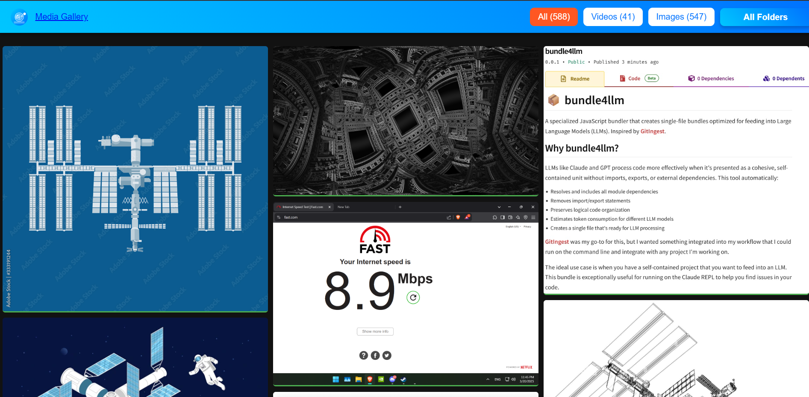

# Py Home Gallery

A lightweight, Flask-based media gallery server designed for browsing and viewing your local media collection across your home network. Perfect for viewing photos and videos from any device, including smart TVs.


## Features

### Core Features

- **3D Cover Flow Browse**: iPod-inspired carousel for navigating folders with keyboard, mouse, and touch support
- **Living Mosaic Background**: Dynamic grid of photos that auto-shuffles for a screensaver effect
- **Multiple Gallery Views**: Browse, Gallery, Random, Newest, and Infinite scroll options
- **Dark/Light Theme Toggle**: Site-wide theme system with localStorage persistence
- **Automatic Video Thumbnails**: Generates thumbnails for videos using the middle frame
- **Responsive Grid Layout**: Square-cornered design with grid-aligned elements across all resolutions
- **Media Filtering**: Filter by media type (video/images) and folders
- **Pagination**: Standard page-based navigation for better performance
- **Infinite Scrolling**: Alternative view with dynamic content loading
- **Lightbox Viewer**: Full-screen viewing for both images and videos
- **Network Accessible**: Access your media from any device on your home network

### 🔒 Security & Reliability (New!)

- **Path Traversal Protection**: Complete protection against directory traversal attacks
- **Input Validation**: All user inputs validated and sanitized
- **Comprehensive Logging**: Structured logging for debugging and auditing
- **Robust Error Handling**: Graceful degradation with detailed error reporting
- **Type Safety**: Full type hints for better code quality

📚 **[View complete documentation →](docs/README.md)**


## Demo

Demo is on [https://py-home-gallery.onrender.com/](https://py-home-gallery.onrender.com/) but its on the free plan so it may take a while to load. See a gif of the demo below:


## Screenshots





## Installation

### Prerequisites

- Python 3.10+
- FFmpeg installed and accessible in PATH (required for video thumbnail generation)

### Setup

1. Clone the repository:
   ```bash
   git clone https://github.com/guinetik/py-home-gallery.git
   cd py-home-gallery
   ```

2. Install dependencies:
   ```bash
   # Option 1: Install via pip (recommended)
   pip install -e .

   # Option 2: Install from requirements.txt
   pip install -r requirements.txt

   # For production deployment, also install waitress:
   pip install -e ".[production]"
   ```

3. Run the application with your media directory:
   ```bash
   # If installed via pip:
   py-home-gallery --media-dir "/path/to/your/media"

   # Or run directly:
   python run.py --media-dir "/path/to/your/media"

   # Or as a module:
   python -m py_home_gallery --media-dir "/path/to/your/media"

   # Specify a custom thumbnail directory
   py-home-gallery --media-dir "/path/to/your/media" --thumbnail-dir "/custom/path/for/thumbnails"

   # Example with all options
   py-home-gallery --media-dir "/home/guinetik/Media" --thumbnail-dir "/home/guinetik/gallery-thumbs" --port 8080 --items-per-page 100
   ```

4. The application will automatically create a thumbnail directory in your home folder:
   - Windows: `C:\Users\YourUsername\.py-home-gallery\thumbnails`
   - Linux/macOS: `~/.py-home-gallery/thumbnails`

5. The application will check if FFmpeg is installed and available in your PATH before starting.

6. Access the gallery:
   Open `http://localhost:8000` in your browser, or use your server's IP address to access it from other devices on your network.

## Usage

- **Main Dashboard**: Navigate to the home page with live mosaic background to choose your view
- **Browse**: 3D Cover Flow carousel for browsing folders (keyboard arrows, mouse wheel, touch swipe, or click)
- **Gallery**: Standard masonry grid view with pagination
- **Shuffle**: Randomized gallery view
- **Newest**: Gallery sorted by most recent files first
- **Infinite Scroll**: Continuously loads more content as you scroll
- **Theme Toggle**: Switch between dark and light modes (top right corner)
- **Folder Dropdown**: Filter media by folder
- **Media Type Filters**: View only images or only videos

## How It Works

Py Home Gallery scans your media directory for images and videos. For videos, it automatically generates thumbnails using FFmpeg/moviepy, which are stored in the thumbnail directory. The application serves both the thumbnails and the original media files through a Flask web server.

The gallery features:
- **Homepage**: Living mosaic background that auto-shuffles random thumbnails every 10 seconds with grid-aligned content cards
- **Browse**: 3D Cover Flow carousel with keyboard, mouse wheel, touch swipe, and click navigation
- **Gallery Views**: Isotope.js masonry layout with multiple sorting options (default, random, newest, infinite scroll)
- **Media Viewer**: GLightbox for full-screen image and video playback
- **Responsive Design**: Grid-aligned square aesthetic that adapts to all screen sizes

## Configuration Options

Py Home Gallery supports the following command-line arguments:

### Basic Options

```
--media-dir PATH       Root directory containing media files
                       (default: ./media)
                       ENV: PY_HOME_GALLERY_MEDIA_DIR

--thumbnail-dir PATH   Directory to store generated thumbnails
                       (default: ~/.py-home-gallery/thumbnails on Linux/Mac
                       or C:\Users\YourUsername\.py-home-gallery\thumbnails on Windows)
                       ENV: PY_HOME_GALLERY_THUMB_DIR

--items-per-page NUM   Number of items to display per page
                       (default: 50)
                       ENV: PY_HOME_GALLERY_ITEMS_PER_PAGE

--host HOST            Host to run the server on
                       (default: 0.0.0.0)
                       ENV: PY_HOME_GALLERY_HOST

--port PORT            Port to run the server on
                       (default: 8000)
                       ENV: PY_HOME_GALLERY_PORT

--placeholder URL      URL for placeholder thumbnails
                       (default: https://via.placeholder.com/300x200)
                       ENV: PY_HOME_GALLERY_PLACEHOLDER

--skip-ffmpeg-check    Skip the check for FFmpeg installation (use at your own risk)
```

### Performance Options

```
--cache-ttl SECONDS    Cache TTL in seconds
                       (default: 300)
                       ENV: PY_HOME_GALLERY_CACHE_TTL

--worker-threads NUM   Number of background worker threads
                       (default: 2)
                       ENV: PY_HOME_GALLERY_WORKER_THREADS

--no-cache             Disable caching

--no-worker            Disable background thumbnail generation
```

### Production Options

```
--production           Run in production mode using Waitress WSGI server
                       (cross-platform, requires: pip install waitress)
                       ENV: PY_HOME_GALLERY_PRODUCTION

--no-serve-media       Disable Flask media file serving
                       (for use with external server like Nginx)
                       ENV: PY_HOME_GALLERY_SERVE_MEDIA
```

### Logging Options

```
--log-level LEVEL      Logging level: DEBUG, INFO, WARNING, ERROR, CRITICAL
                       (default: INFO)
                       ENV: PY_HOME_GALLERY_LOG_LEVEL

--log-dir PATH         Directory for log files
                       (default: ./logs)
                       ENV: PY_HOME_GALLERY_LOG_DIR

--no-log-file          Disable logging to file (log to console only)
```

The environment variables can be set differently depending on your shell:

### Command Prompt (CMD)
```cmd
SET PY_HOME_GALLERY_MEDIA_DIR=C:\path\to\media
SET PY_HOME_GALLERY_PORT=8080
```

### PowerShell
```powershell
$env:PY_HOME_GALLERY_MEDIA_DIR = "C:\path\to\media"
$env:PY_HOME_GALLERY_PORT = "8080"
```

### Bash/Linux/macOS
```bash
export PY_HOME_GALLERY_MEDIA_DIR="/path/to/media"
export PY_HOME_GALLERY_PORT="8080"
```

## Common Usage Examples

### Basic Usage (Windows - CMD)
Start the server with the default settings but point to your media directory:
```cmd
python run.py --media-dir "%USERPROFILE%\Media"
```

### Basic Usage (Windows - PowerShell)
Start the server with the default settings but point to your media directory:
```powershell
python run.py --media-dir "$env:USERPROFILE\Media"
```

### Change Server Port (Windows - CMD)
Run on a different port (useful if port 8000 is already in use):
```cmd
python run.py --media-dir "%USERPROFILE%\Media" --port 8080
```

### Change Server Port (Windows - PowerShell)
Run on a different port (useful if port 8000 is already in use):
```powershell
python run.py --media-dir "$env:USERPROFILE\Media" --port 8080
```

### Specify Thumbnail Location (Windows - CMD)
Store thumbnails in a custom location:
```cmd
python run.py --media-dir "%USERPROFILE%\Media" --thumbnail-dir "D:\thumbnails"
```

### Specify Thumbnail Location (Windows - PowerShell)
Store thumbnails in a custom location:
```powershell
python run.py --media-dir "$env:USERPROFILE\Media" --thumbnail-dir "D:/thumbnails"
```

### Using Environment Variables (Windows - CMD)
You can also set options using environment variables in Command Prompt:
```cmd
:: Set options via environment variables
SET PY_HOME_GALLERY_MEDIA_DIR=%USERPROFILE%\Media
SET PY_HOME_GALLERY_PORT=8080

:: Then run without command-line arguments
python run.py
```

### Using Environment Variables (Windows - PowerShell)
You can also set options using environment variables in PowerShell:
```powershell
# Set options via environment variables
$env:PY_HOME_GALLERY_MEDIA_DIR = "$env:USERPROFILE\Media"
$env:PY_HOME_GALLERY_PORT = "8080"

# Then run without command-line arguments
python run.py
```

### Multiple-Instance Setup (Windows - CMD)
Run multiple instances for different media collections:
```cmd
:: Run first instance for photos
python run.py --media-dir "%USERPROFILE%\Pictures" --port 8000

:: Run second instance for videos on a different port
python run.py --media-dir "%USERPROFILE%\Videos" --port 8001
```

### Multiple-Instance Setup (Windows - PowerShell)
Run multiple instances for different media collections:
```powershell
# Run first instance for photos
python run.py --media-dir "$env:USERPROFILE\Pictures" --port 8000

# Run second instance for videos on a different port
python run.py --media-dir "$env:USERPROFILE\Videos" --port 8001
```

### Basic Usage (Linux/macOS)
Start the server with the default settings but point to your media directory:
```bash
python run.py --media-dir "/home/guinetik/Media"
# OR using home directory shorthand
python run.py --media-dir "~/Media"
```

### Change Server Port (Linux/macOS)
Run on a different port (useful if port 8000 is already in use):
```bash
python run.py --media-dir "~/Media" --port 8080
```

### Specify Thumbnail Location (Linux/macOS)
Store thumbnails in a custom location:
```bash
python run.py --media-dir "~/Media" --thumbnail-dir "/mnt/external/thumbnails"
```

### Using Environment Variables (Linux/macOS)
You can also set options using environment variables:
```bash
# Set options via environment variables
export PY_HOME_GALLERY_MEDIA_DIR="$HOME/Media"
export PY_HOME_GALLERY_PORT="8080"

# Then run without command-line arguments
python run.py
```

### Multiple-Instance Setup (Linux/macOS)
Run multiple instances for different media collections:
```bash
# Run first instance for photos
python run.py --media-dir "~/Photos" --port 8000

# Run second instance for videos on a different port
python run.py --media-dir "~/Videos" --port 8001
```

### Notes on Windows Path Syntax

On Windows, path handling differs between Command Prompt (CMD) and PowerShell:

#### Command Prompt (CMD)

1. Use environment variables with percent signs: `python run.py --media-dir "%USERPROFILE%\Media"`
2. Escape backslashes by doubling them: `python run.py --media-dir "C:\Users\guinetik\Media"`
3. Or use forward slashes: `python run.py --media-dir "C:/Users/guinetik/Media"`

#### PowerShell

1. Use environment variables with `$env:`: `python run.py --media-dir "$env:USERPROFILE\Media"`
2. Use forward slashes to avoid escape issues: `python run.py --media-dir "C:/Users/guinetik/Media"`
3. Or use the `-f` string formatting to handle backslashes properly: 
   ```powershell
   $mediaDir = "{0}\Media" -f $env:USERPROFILE
   python run.py --media-dir "$mediaDir"
   ```

The tilde (`~`) shorthand for home directory doesn't work in Windows terminals. Use `%USERPROFILE%` (CMD) or `$env:USERPROFILE` (PowerShell) instead.

## Docker Deployment (Production)

For production use, Py Home Gallery can be deployed with Docker + Nginx for optimal performance. This setup uses Nginx to serve static files (media and thumbnails) while Flask handles the API and dynamic content.

### Quick Start with Docker

1. **Create environment file** from the template:
   ```bash
   cp .env.example .env
   ```

2. **Edit `.env`** with your paths:
   ```bash
   MEDIA_DIR=/path/to/your/media
   THUMBNAIL_DIR=/path/to/your/thumbnails
   HOST_PORT=8000
   WORKER_THREADS=2
   ```

3. **Build and run**:
   ```bash
   docker-compose up -d
   ```

4. **Access the gallery** at `http://localhost:8000` (or your configured port)

### Architecture

The Docker setup includes:
- **Nginx**: Serves static files (media/thumbnails) with efficient caching
- **Flask + Waitress**: Handles API requests and on-demand thumbnail generation
- **Volume Mounts**: Your media and thumbnails are mounted read-only (media) and read-write (thumbnails)

### Docker Configuration

**Environment Variables** (`.env` file):
```bash
# Required: Path to your media files
MEDIA_DIR=/path/to/your/media

# Required: Path for generated thumbnails
THUMBNAIL_DIR=/path/to/your/thumbnails

# Optional: Host port (default: 8000)
HOST_PORT=8000

# Optional: Number of worker threads (default: 2)
WORKER_THREADS=2
```

### Advanced Docker Usage

**View logs**:
```bash
docker-compose logs -f
```

**Rebuild after changes**:
```bash
docker-compose up -d --build
```

**Stop the containers**:
```bash
docker-compose down
```

**Check environment variables**:
```bash
docker exec py-home-gallery env | grep PY_HOME_GALLERY
```

### Performance Benefits

Compared to running Flask directly:
- **3-5x faster** static file serving via Nginx
- **Multi-threaded** request handling with Waitress
- **Efficient caching** with proper cache headers
- **Automatic thumbnail fallback** - if thumbnail missing, Nginx forwards to Flask to generate it

### Nginx Fallback Behavior

When you request a thumbnail that doesn't exist yet:
1. Nginx tries to serve from `/thumbnails/`
2. If not found, forwards request to Flask via `@flask_fallback`
3. Flask generates thumbnail on-demand
4. Subsequent requests are served directly by Nginx (cached)

This provides the best of both worlds: fast serving + on-demand generation.

## Customization

- **Thumbnail Size**: Modify the thumbnail dimensions in the `serve_thumbnail` function
- **Styling**: Customize the appearance by modifying the CSS in the HTML templates

## Recommended Use

This application works great as a simple home media server. Set it up on a computer that's always on (or a Raspberry Pi), transfer media from your phone using your preferred sync method, and access it from any device in your home, including smart TVs, via a web browser.

## Troubleshooting

### Slow Lightbox Performance on Windows

**Issue**: GLightbox feels sluggish when navigating between images, especially on Windows.

**Cause**: Flask's development server is single-threaded, and GLightbox's default preload setting tries to load multiple images simultaneously, which can overwhelm the server.

**Solution**: The application is now configured with `preload: false` by default, which disables image preloading in GLightbox. This provides better performance on Flask's development server.

**For Production**: If you deploy with a production WSGI server (like Gunicorn or Waitress), you can enable preload for better user experience:

```javascript
// In static/gallery.js, you can customize GLightbox options:
const { iso, lightbox } = initializeGallery({
    // ... other options
});

// Or enable preload manually:
initializeGLightbox('.glightbox', { preload: true });
```

### Background Workers

**Disable workers** if they're causing issues:
```bash
# Command line
python run.py --no-worker

# Environment variable
export PY_HOME_GALLERY_WORKER_ENABLED=false
```

**Adjust worker threads** for better performance:
```bash
# Use more threads (default is 2)
python run.py --worker-threads 4
```

### Performance Tips

1. **Use SSD storage** for media and thumbnails when possible
2. **Disable antivirus scanning** for the media and thumbnail directories (if safe to do so)
3. **For production**, use the production mode flag:
   ```bash
   # Install waitress (cross-platform WSGI server)
   pip install waitress

   # Run in production mode
   python run.py --media-dir "/path/to/media" --production
   ```
   This uses Waitress instead of Flask's development server for better performance and concurrency.

## License

This project is licensed under the MIT License - see the LICENSE file for details.

## Acknowledgments

- [Flask](https://flask.palletsprojects.com/)
- [Isotope.js](https://isotope.metafizzy.co/)
- [GLightbox](https://biati-digital.github.io/glightbox/)
- [MoviePy](https://zulko.github.io/moviepy/)